<h1 align="center">Hi, I'm Marcos Melo</h1>
<h3 align="center">Full Stack Software Engineer from Brazil, working remotely</h3>

  
  
   
  
  

  
  
  
  
  
  
  
  
  
  

## Tech Stack

<table>
<tr>

<td valign="top" width="25%">

### Frontend

<a href="https://github.com/marcosvnmelo">

  
    
     
    

</a>

</td>

<td valign="top" width="25%">

### Mobile

<a href="https://github.com/marcosvnmelo">

    
     
    

</a>

</td>

<td valign="top" width="25%">

### Backend

<a href="https://github.com/marcosvnmelo">

    
     
    

</a>

</td>

<td valign="top" width="25%">

### Data

<a href="https://github.com/marcosvnmelo">

    
     
    

</a>

</td>

</tr>
<tr>

<td valign="top" width="25%">

### Cloud

<a href="https://github.com/marcosvnmelo">

  
    
     
    

</a>

</td>

<td valign="top" width="25%">

### Testing

<a href="https://github.com/marcosvnmelo">

    
     
    

</a>

</td>

<td valign="top" width="25%">

### Architecture

<a href="https://github.com/marcosvnmelo">

    
     
    

</a>

</td>

<td valign="top" width="25%">

### Automation

<a href="https://github.com/marcosvnmelo">

    
     
    

</a>

</td>

</tr>

</table>

## GitHub

  
  

  

